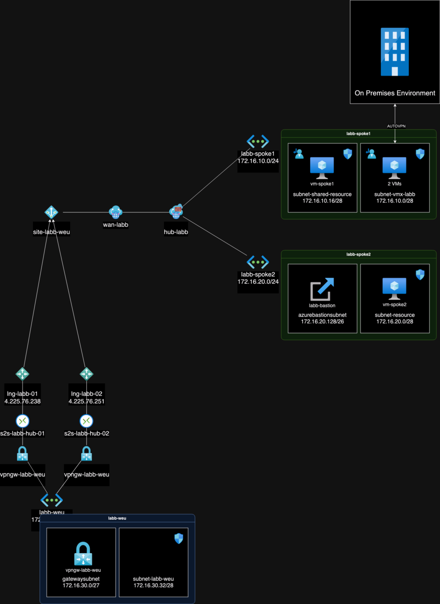
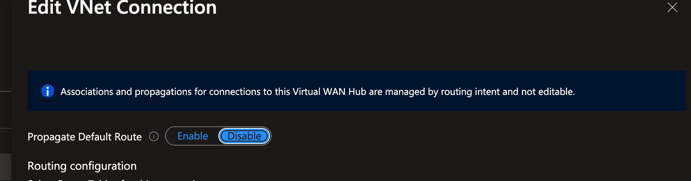

# Using Cisco Meraki VMX with Azure Secured Hub

The configuration process proved more challenging than initially anticipated. Existing guides and knowledge bases did not incorporate a Secured hub, indicating the absence of an Azure firewall deployment within the hub. Over the past few months, I engaged in multiple discussions with both Cisco Meraki and Microsoft Support to address this issue.

As of yesterday, the deployment in the production environment has been successfully executed, resulting in the resolution of all previously encountered issues.

## Environment

In my lab I have the following resources:

- Virtual WAN
- Virtual Hub
- Azure Firewall in the hub
- Two spokes in Azure Sweden Central
    - Two subnets
    - VM:s in each subnet
    - Bastion in one of subnets for remote access
- One spoke in Azure West Europe
- VPN Gateway in West Europe
- On Premise Meraki Firewall
- Meraki VMX deployed in a subnet in the shared vnet

A distinctive aspect of our environment is the coexistence of VMX within a shared virtual network alongside other shared subnets. Our objective is to direct traffic from these subnets through the Azure Firewall. Consequently, each subnet within this is configured with User-Defined Routes (UDRs) to direct traffic to the Firewall.

## Settings required in our environment

The approach may vary depending on your specific objectives and desired outcomes. In my case, I joined an existing environment, so the adjustments required may differ based on your unique circumstances.

To facilitate BGP functionality in this scenario, it is required to activate Routing Intent

Disable the Propagate Default Route setting on the virtual network connection linked to the virtual network housing the VMX. However, the necessity of this action may vary based on your specific traffic flow requirements.

Enable the Propagate Gateway Routes feature for the route table associated with the subnet housing the VMX. 

Additionally, it is crucial to incorporate a rule in the Network Security Group (NSG) associated with the VMX's subnet for on-premise IP addresses. Correspondingly, ensure that the Azure firewall rules permit the required traffic.

In an environment featuring User-Defined Route (UDR) on the VMX's subnet, ensure the presence of routes in Azure. Given that the Meraki VMX operates as a layer 2 bridge, adherence to these routes is essential for its proper functioning.

I hope this provided some insights to anyone trying to do the same.